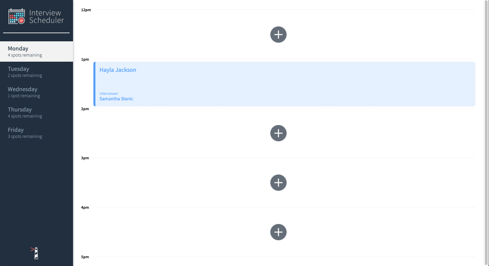
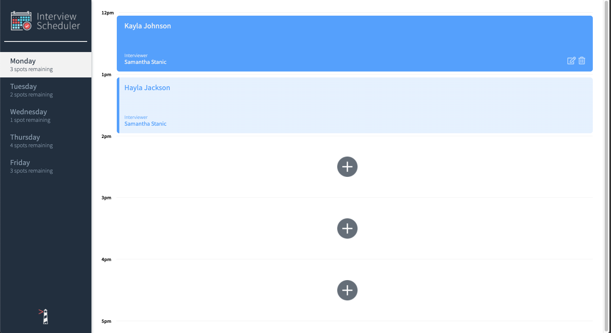
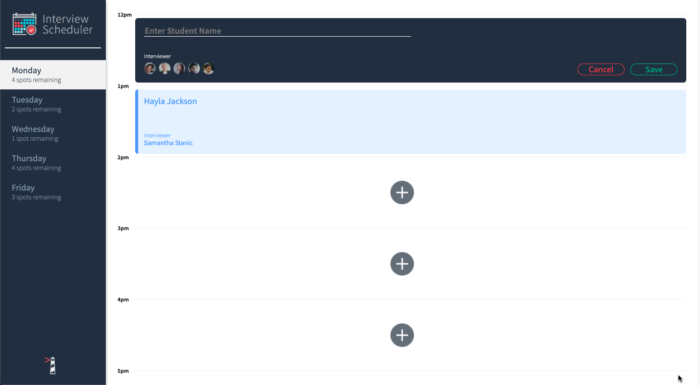

[]()
[]()


# Summary

Scheduler provides a simple single page UI for booking, editing and removing appointments.

# Functionality

## Home Page & Search-bar

Homepage View


Edit/Delete Button Revealed On Appointment Mouseover


Clicking Large + Button Brings up New Appontment Form

For more user stories [click here](./public/UserStories.md)

# Project Structure

- Front-End
  - [Components](/src/components)
  - [Helper Functions](/src/helpers)
  - [Hooks](/src/hooks)
  - [Styles](src//Styles)
- Back-End 
  - NOTE: - Scheduler connects with the Scheduler-API. Please [Fork](https://github.com/araff-16/scheduler-api/fork) this repository and follow the instructions in the README before running Scheduler.

# Project Setup

## Setup

Install dependencies with `npm install`.

## Running Webpack Development Server

```sh
npm start
```

## Running Jest Test Framework

```sh
npm test
```

## Running Storybook Visual Testbed

```sh
npm run storybook
```


